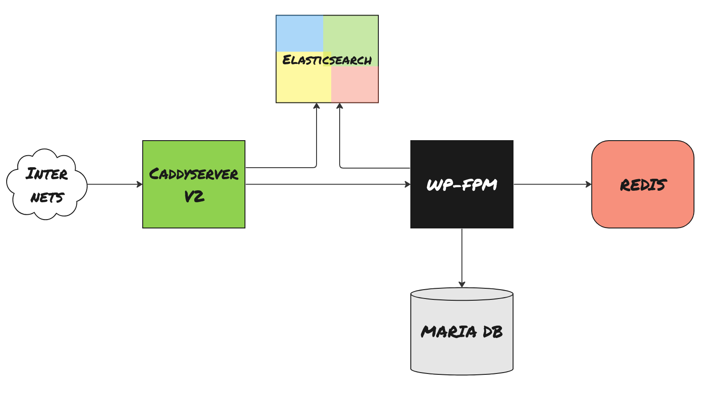

# Caddy V2 Bases PHP Cloud for Wordpress
(or anything else actually)

Running Caddy 2.7.5 Alpine.

[Caddyserver](https://caddyserver.com/) is a compact but secure and very powerful web/proxy server with automatic certificate updates for safe TLS communication.

[Wordpress](https://wordpress.org/) is... Wordpress. 

While this repo and Readme aims to make a secure WP installation, you can use it for anything PHP if you want to. You can easily add your own site config and host other static and non-static pages with the same Caddy instance.

This is a complete Docker Compose setup that needs minimal effort from you to get it up and running. Or, you can go all in and make it e-shop production ready.

This is what you get if you do all the config in this README. Don't worry! Most is already in place and the wall-of-text below is mostly to document how the setup works.

Is this installation working? Sure is! This is running live hosting websites already.

## Minimal Effort Local Setup

 - Clone this repository to your local workstation

 - docker

 - `docker compose up -d`

 - Open up a browser to https://localhost and complete the Wordpress config

Please note that by running WP without public Internet access, you need to install all plugins manually.

## Medium Effort Setup

 - Get a server (a publicly exposed Linux machine)

 - Make sure you have DNS record pointing to your server

 - Clone this repo (duh, on the server...)

 - Edit the files in the `conf` folder and set proper values. The `conf` files and their purpose is described in detail further down. The important files are:

   - `caddy.env` 
   - `db.env`
   - `wordpress.env`, make sure the values match `db.env`

 - `docker compose up -d`

 - Open up a browser to https://whatever.domain.you.have and complete the Wordpress config

## Extra Features

### Reload a container when you do changes

To get configuration changes to take effect in a running container you need to restart it. For example if a change affects Caddy, you need to run:

    docker compose stop caddy && docker compose up -d caddy

### Password Safing Your Page

 If this is a work in progress project and you want to protect it from curious people, you can add a basic auth by editing the file `conf/basic_auth.conf`.

 To get a new password, you need to use Caddy's password command. We can reach this command via Docker:

    $ docker compose exec caddy caddy hash-password
    Enter password: 
    Confirm password: 
    $2a$14$.Fyy1x0/sdSIqQW93ap.lOR3Kj5eJY12BHonK3Z9DjCf3Nv1kJTwG

The `caddy caddy` is not a typo! The first `caddy` is the Docker container and the latter is the `caddy` application being executed as a command - inside the `caddy` container.

### Install WP-CLI

This tool comes in handy if you need to work with WP where the admin UI is not helping you, like setting parameters etc that can't be changed in the web admin.
Let's install `wp-cli` in the `wp-fpm` container

    $ docker compose exec wp-fpm sh
    # cd /tmp
    # curl -O https://raw.githubusercontent.com/wp-cli/builds/gh-pages/phar/wp-cli.phar
    # chmod +x wp-cli.phar
    # mv wp-cli.phar /usr/local/bin/wp

A word of caution! You need to run it as root inside the container. Be careful, you can mess up completely.

## The Advanced Stuff That Makes Your Site go Speedy Gonzales

### What You Should do Before Entering This Section

You should install most, if not all, plugins you want to run before you continue. If this is going to be any kind of Woocommerce site, you really should setup Woo first.

### Add Redis for Performance

[Redis](https://redis.io/) is already running and is prepared to serve WP, but you need to fix some stuff in WP to get caching with Redis.

You need to install a Redis plugin in WP and following config is using the [Redis Object Cache](https://wordpress.org/plugins/redis-cache/)

 - Install WP-CLI according to the steps above
 - If you left the shell, reconnect with `docker compose exec wp-fpm sh`
 - Execute `wp --allow-root config set WP_REDIS_HOST redis`. This overrides the default localhost to instead point to the docker instance named `redis`
 - Go to your WP Admin UI and install and activate the cache plugin (search for _Redis Object Cache_)
 - The plugin should now show up in the header menu and in the side menu. Go to settings and Connect to Redis. If everything works as planned you should see caching stats immediately

### Add Elastic for Speedy Search

[Elasticsearch](https://www.elastic.co/) is already running, and both Elastic and Caddy is prepared to get some nasty fast search features enabled! This is a bit tricky though as you need to do some manual config in WP.

We are going to use the open source [Elasticpress plugin](https://wordpress.org/plugins/elasticpress/) to get everything connected.

 - Install and activate the Elasticpress plugin
 - In the config, go to the `Third-Party/Self-Hosted` tab
 - Set the config _Elasticsearch Host URL_ to `http://elastic:9200`
 - Everything else can be default, click _Save Changes_
 - When asked what to index, you choose! This is _my_ list_
   - [x] Post Search
   - [x] Autosuggest
   - [_] Did You Mean
   - [x] WooCommerce
   - [_] Protected Content
 - Save Features
 - Index Your Content

You can always go back to ElasticPress and resync manually!

Now, you need to find the index name Elasticpress created.

 - Go to the _Index Health_ panel and copy the name listed in the _Index list_. It is usually in the format `[domain_name_without_dots]-post-1`

Let's do features config.

#### Autosuggest

 - In the _Features_ panel, open _Autosuggest_
 - Status should be `enabled`
 - The `Endpoint URL` needs the index name you figured out above. Your URL setting should be as `https://[domain_name]/es-search/[index_name]/_search`. As an example, if my server is jabba.doo.net, the URL endpoint will most likely be `https://jabba.doo.net/es-search/jabbadoonet-post-1/_search`

With this set and if you have content (like posts or Woo products) you will get a drop down with auto suggestions when you start writing in a search box in the frontend.

If it doesn't work? 
- Make sure your theme is supporting the auto suggestion selector that Autosuggest uses
- Check the network tab in the browser developer tools. Are the fetch requests that pops up when you write ok? Are they red? In that case the frontend can't request the Elastic index and you may have the wrong `Endpoint URL`

Caddy is proxying the Elastic server and only search requests to indices are allowed through.

#### Post Search

 - In the _Features_ panel, open _Post Search_ and make sure _Excerpt highlighting_ is `enabled`

## Config Files Detailed Explanation

The files in the `conf` directory should be protected and only accessible for, `chmod 0600` is a good start.

### conf/basic_auth.conf ###
If you want to password protect your page you can uncomment the block in `basic_auth.conf` and if you want to make other URLs or similar protected you can configure this block as you want. It is a standard
Caddy `import file` directive in the Caddy config so anything goes. 
Make sure your setup works first before adding a password.

### conf/caddy_sensitive.env ###
This file is only used if you use a DNS challenge for the certificate. If you do you know it and how to use it is documented in Caddy documentation and somewhat in the `caddy.env` file.

### conf/caddy.env ###
If you are going to use this setup for local development (on your workstation), leave it as it is. If you are setting up a test server or server accessed from a public domain, do following changes:
* Change `SERVER_NAME` to your fully qualified domain name, if you have one. This is the name you must use to get the server to respond later on.
* Change the TLS mode. If this server has a public name and adress (i.e. you can reach it from the Internetz) set `TLS_MODE` to `tls_auto` and you will auto fetch a valid certificate. If you need another setup, read the comments in the `caddy.env` file.

### conf/caddyfile_optional.conf ###
This is a pure Caddyfile import! You can add any Caddyserver config here and it will be imported to the active Caddyfile. You can host extra sites, setup redirects and whatelse you can do with Caddy.

In the file there is an example how to configure your server to redirect and get rid of the oldschool `www` prefix.

### conf/db.env ###
Set GOOD user names and passwords in `db.env`. Long and ugly! These settings are used to automatically create the database when then Maria DB container startup for the first time.

### conf/global.env ###
This file has PHP specific settings and are injected into the `wp-fpm` node. If you find yourself in need to trace PHP or similare, change or add settings in here and restart the container to reload.

### conf/wordpres.env ###
Wordpress specific settings. DB-connection credentials here should match the credentials in `db.env`.